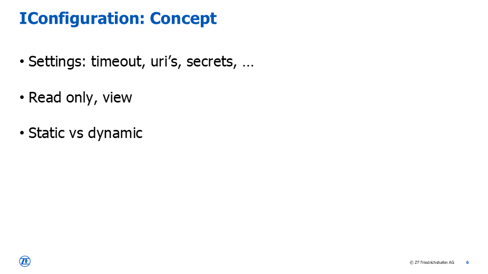
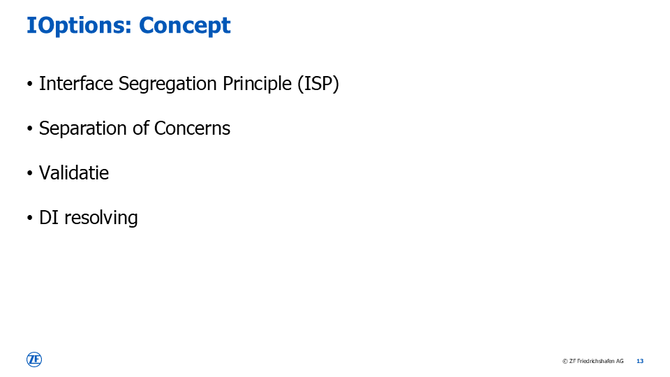
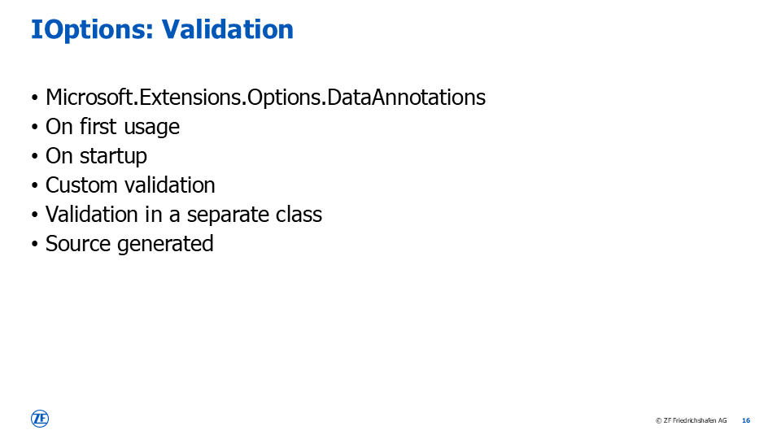
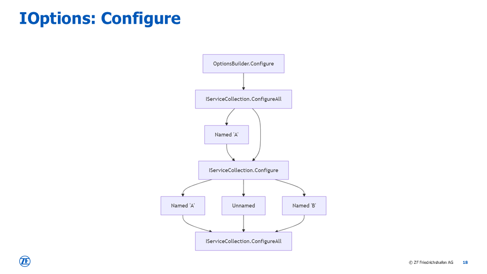

# Say Goodbye to IConfiguration and Embrace the Power of the IOptions Pattern
This presentation explores the transition from IConfiguration to the IOptions pattern in .NET applications.
IConfiguration is used for obtaining settings like timeouts, URIs, and even secrets.
This by using providers which request data from environment variables, JSON files, and custom sources.
However, IOptions offers a more robust solution by providing strong-typed configuration,
promoting separation of concerns, and enhancing maintainability.

The different types of IOptions include IOptions<T>, IOptionsSnapshot<T> and IOptionsMonitor<T>.
Each serving specific needs for configuration management.
Validation is crucial to ensure configuration integrity,
using methods like data annotations and custom validation.

Advanced configuration techniques are also covered,
demonstrating how to create custom providers and implement hierarchical mapping.
Adopting the IOptions pattern significantly improves the maintainability and performance of .NET applications,
making it a valuable practice for developers.

# Slides

